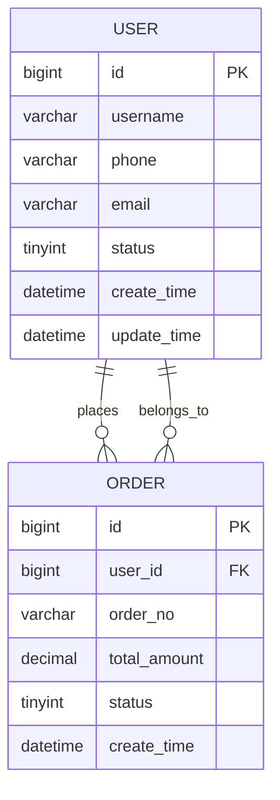

# 🗄️ 数据库设计器

> 根据业务需求，生成规范的 MySQL ERD + DDL + Java Entity 代码

---

## 核心能力

| 能力 | 说明 |
|------|------|
| ERD 生成 | 输入业务描述，输出 Mermaid ERD 图 |
| DDL 生成 | MySQL 建表语句，含约束/索引/外键 |
| Java Entity 生成 | 对应 Java Entity/Mapper 代码 |
| 规范化检查 | 分析 1NF~BCNF，指出违反项并给出修正方案 |
| 索引优化 | 根据查询模式推荐索引策略 |
| 迁移脚本 | expand-contract 模式，支持零停机字段变更 |

---

## 工作流程

### Step 1：收集业务信息

请提供以下信息（尽量完整，可以只有部分）：

```
业务模块：____
核心实体：____（如：用户、订单、商品）
主要关系：____（如：一个用户有多个订单）
查询场景：____（如：按时间查订单、按分类查商品）
数据量预估：____（如：订单表预估1000万条）
特殊需求：____（如：支持软删除、历史数据分区）
```

### Step 2：生成 ERD（Mermaid 格式）

```
用户 → 订单（1对多）
用户 → 收货地址（1对多）
订单 → 订单明细（1对多）
商品 → 订单明细（多对多，通过中间表）
```



### Step 3：生成 MySQL DDL

```sql
-- 用户表
CREATE TABLE `sys_user` (
    `id` BIGINT UNSIGNED NOT NULL AUTO_INCREMENT COMMENT '主键ID',
    `username` VARCHAR(50) NOT NULL COMMENT '用户名',
    `phone` VARCHAR(20) DEFAULT NULL COMMENT '手机号',
    `email` VARCHAR(100) DEFAULT NULL COMMENT '邮箱',
    `status` TINYINT NOT NULL DEFAULT 1 COMMENT '状态：0-禁用 1-正常',
    `create_time` DATETIME NOT NULL DEFAULT CURRENT_TIMESTAMP COMMENT '创建时间',
    `update_time` DATETIME NOT NULL DEFAULT CURRENT_TIMESTAMP ON UPDATE CURRENT_TIMESTAMP COMMENT '更新时间',
    PRIMARY KEY (`id`),
    UNIQUE KEY `uk_username` (`username`),
    KEY `idx_phone` (`phone`),
    KEY `idx_status` (`status`)
) ENGINE=InnoDB DEFAULT CHARSET=utf8mb4 COMMENT='用户表';

-- 订单表
CREATE TABLE `crm_order` (
    `id` BIGINT UNSIGNED NOT NULL AUTO_INCREMENT COMMENT '主键ID',
    `user_id` BIGINT UNSIGNED NOT NULL COMMENT '用户ID',
    `order_no` VARCHAR(32) NOT NULL COMMENT '订单号',
    `total_amount` DECIMAL(12,2) NOT NULL DEFAULT 0.00 COMMENT '订单总额',
    `status` TINYINT NOT NULL DEFAULT 1 COMMENT '状态：1-待支付 2-已支付 3-已完成 4-已取消',
    `create_time` DATETIME NOT NULL DEFAULT CURRENT_TIMESTAMP COMMENT '创建时间',
    PRIMARY KEY (`id`),
    UNIQUE KEY `uk_order_no` (`order_no`),
    KEY `idx_user_id` (`user_id`),
    KEY `idx_status` (`status`),
    KEY `idx_create_time` (`create_time`),
    CONSTRAINT `fk_order_user` FOREIGN KEY (`user_id`) REFERENCES `sys_user` (`id`)
) ENGINE=InnoDB DEFAULT CHARSET=utf8mb4 COMMENT='订单表';
```

### Step 4：生成 Java Entity

```java
package com.fehorizon.crm.entity;

import com.baomidou.mybatisplus.annotation.*;
import lombok.Data;
import java.math.BigDecimal;
import java.time.LocalDateTime;

@Data
@TableName("crm_order")
public class CrmOrder {

    @TableId(type = IdType.AUTO)
    private Long id;

    @TableField("user_id")
    private Long userId;

    @TableField("order_no")
    private String orderNo;

    @TableField("total_amount")
    private BigDecimal totalAmount;

    @TableField("status")
    private Integer status;

    @TableField(value = "create_time", fill = FieldFill.INSERT)
    private LocalDateTime createTime;
}
```

---

## 规范化检查清单

### 1NF - 原子性
| 检查项 | ❌ 违反 | ✅ 正确 |
|--------|---------|---------|
| 单列多值 | `phones VARCHAR(200)` 存多个电话 | 拆分到中间表 |
| 混合格式 | 地址列存省市区+详细地址 | 拆成多个字段 |

### 2NF - 消除部分依赖
| 检查项 | ❌ 违反 | ✅ 正确 |
|--------|---------|---------|
| 主键复合键 | 主键(id, type)，但name只依赖id | 拆表，name留在主表 |

### 3NF - 消除传递依赖
| 检查项 | ❌ 违反 | ✅ 正确 |
|--------|---------|---------|
| 冗余字段 | 用户表存了部门名称（部门ID已够） | 只存部门ID |

### BCNF - 主键分解
| 检查项 | ❌ 违反 | ✅ 正确 |
|--------|---------|---------|
| 主键冲突 | 导师-学生表，学生邮箱决定导师 | 拆表 |

---

## 索引优化策略

### 组合索引列顺序规则

```
根据查询频率确定列顺序：
1. 等值查询的列 → 放最前面
2. 范围查询的列 → 放最后面
3. ORDER BY 的列 → 尽量包含
```

**示例：**
```sql
-- 常见查询：WHERE status = ? AND create_time > ? ORDER BY create_time
CREATE INDEX idx_status_time ON orders (status, create_time);
-- ✅ status 等值放前，create_time 范围+排序放后
```

### 索引类型选择

| 场景 | 推荐索引 |
|------|---------|
| 主键/唯一约束 | PRIMARY KEY / UNIQUE |
| 常见等值查询 | 普通 B-TREE 索引 |
| 范围查询（时间/金额） | 普通索引 |
| 模糊查询 LIKE "xxx%" | 前缀索引 |
| JSON 字段查询 | 函数索引 / GENERATED COLUMN |
| 高并发写入 | 减少不必要的索引 |

### 避免的索引陷阱

| ❌ 错误做法 | ✅ 正确做法 |
|-----------|-----------|
| 每个列都加索引 | 只给高频WHERE条件的列加索引 |
| 重复索引（相同列组合） | 删除重复索引 |
| 在低选择性列上建索引（性别） | 不建或联合高频列 |
| 索引列上使用函数 | 改用表达式索引 |

---

## 命名规范

### 表命名

| 类型 | 规则 | 示例 |
|------|------|------|
| 系统表 | sys_模块名 | sys_user / sys_dict |
| 业务表 | 用途_归属 | crm_order / mmp_product |
| 关联表 | 主表_附表 | user_role / order_goods |
| 历史表 | 表名_history | order_history |
| 日志表 | log_模块 | log_operation / log_login |

### 字段命名

| 类型 | 规则 | 示例 |
|------|------|------|
| 主键 | id | BIGINT id |
| 外键 | 表名单数_id | user_id / order_id |
| 时间 | _time | create_time / update_time |
| 状态 | status | TINYINT status |
| 逻辑删除 | deleted | TINYINT deleted |
| 乐观锁 | version | INT version |
| 冗余字段 | 原表_原字段 | user_name（从user表冗余） |

### 索引命名

```
idx_字段名1_字段名2    -- 普通索引
uk_字段名              -- 唯一索引
fk_附表_主表           -- 外键索引
pk_表名                -- 主键（一般用PRIMARY KEY）
```

---

## 零停机迁移（Expand-Contract）

### 场景：给 users 表加一个唯一字段 unique_code

**Phase 1 - Expand（添加新结构）：**
```sql
-- 1. 加一个新列（允许NULL）
ALTER TABLE users ADD COLUMN new_code VARCHAR(64) DEFAULT NULL COMMENT '唯一标识';

-- 2. 批量回填数据（分批，避免锁表）
UPDATE users SET new_code = UUID() WHERE id BETWEEN 1 AND 1000;
-- 重复分批直到全部完成

-- 3. 加唯一约束
ALTER TABLE users ADD UNIQUE KEY `uk_new_code` (`new_code`);

-- 4. 改为 NOT NULL（可选）
UPDATE users SET new_code = id WHERE new_code IS NULL;
ALTER TABLE users MODIFY COLUMN new_code VARCHAR(64) NOT NULL;
```

**Phase 2 - Contract（切换并清理）：**
```sql
-- 5. 确认应用已改完，开始使用 new_code

-- 6. 删除旧列（如需）
ALTER TABLE users DROP COLUMN old_code;
```

---

## 输出格式选项

| 格式 | 内容 |
|------|------|
| Mermaid ERD | 可直接粘贴到 draw.io / Typora / GitLab |
| MySQL DDL | 建表SQL，可直接 DBeaver 执行 |
| MyBatis-Plus Entity | Java Entity 代码（MyBatis-Plus 注解） |
| 完整建表包 | DDL + Entity + Mapper 接口 |

---

## 使用提示

- 直接描述业务场景，如"设计一个客户管理模块，包含客户、商机、跟进记录"
- 可以粘贴现有表结构，让 AI 分析规范化问题和优化建议
- 可以指定数据库：MySQL / PostgreSQL / Oracle（MySQL 为默认）
- 需要生成 Java 代码时，加上"生成Entity"

---

## 一句话原则

> 好的数据库设计 = 业务清晰 + 结构规范 + 性能友好。
> ERD 是给人类看的图，DDL 是给机器看的规则，Entity 是连接两者的桥梁。
