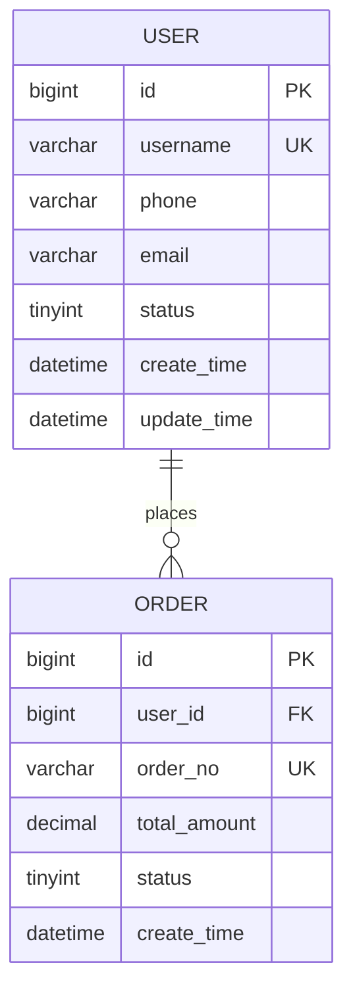

# 📊 ERD 系统设计文档生成器

> 输入 PRD → 输出完整的 Word/PDF 系统设计文档

---

## 核心能力

| 能力 | 输出内容 |
|------|---------|
| **ERD 图** | Mermaid 格式，可嵌入 Word/PDF |
| **DDL 建表语句** | MySQL 格式，可直接执行 |
| **Java Entity** | MyBatis-Plus 注解版本 |
| **完整 Word 文档** | 11个章节，结构完整 |
| **完整 PDF 文档** | 同 Word 内容，PDF 格式 |

---

## 文档结构（11个章节）

```
系统-模块-ERD.docx / .pdf
│
├── 封面（标题/版本/日期/作者）
├── 目录
│
├── 1. 系统介绍
│   ├── 1.1 背景
│   ├── 1.2 功能概述
│   └── 1.3 依赖关系
│
├── 2. 系统结构设计
│   ├── 2.1 系统流程/时序图（Mermaid）
│   └── 2.2 子模块流程图
│
├── 3. 数据库表设计        ← ERD 核心区
│   ├── 3.1 ERD 图（Mermaid）
│   ├── 3.2 表结构详情（每张表一页）
│   ├── 3.3 DDL 建表语句
│   └── 3.4 Java Entity 代码
│
├── 4. 定时任务
│
├── 5. 外部依赖
│   └── 5.1 外部接口清单
│
├── 6. 接口设计
│   └── 6.1 内外部接口清单
│
├── 7. 初始化说明
│   ├── 7.1 数据初始化（表结构/枚举）
│   ├── 7.2 权限初始化
│   ├── 7.3 配置中心参数
│   └── 7.4 Job 定义配置
│
├── 8. 系统安全保密设计
│
├── 9. 系统防呆设计
│
├── 10. 系统性能设计
│
└── 11. 系统出错处理
```

---

## 工作流程

### Step 1：收集 PRD 信息

**必须提供：**
```
- 系统名称/模块名称
- 核心业务功能描述
- 主要实体和关系
- 查询场景和数据量预估
```

**可选提供（越多越完整）：**
```
- 系统流程/业务流程
- 外部依赖系统/接口
- 定时任务需求
- 安全/权限要求
- 性能要求（并发/响应时间）
```

### Step 2：设计 ERD

1. **识别实体**：从 PRD 中提取核心业务实体
2. **确定关系**：1对1 / 1对多 / 多对多
3. **定义字段**：每张表的字段、类型、约束
4. **检查规范化**：1NF~BCNF 检查
5. **设计索引**：根据查询场景添加索引

### Step 3：生成文档内容

分章节输出，每章节内容由 AI 根据 PRD 推断补充。

### Step 4：输出文件

| 格式 | 生成方式 | 输出路径 |
|------|---------|---------|
| **Word (.docx)** | docx Skill 生成 | `D:\xgq\work\` |
| **PDF** | Word 转 PDF | `D:\xgq\work\` |

---

## ERD 设计规范（数据库表设计核心）

### 表命名规则

| 类型 | 规则 | 示例 |
|------|------|------|
| 系统表 | sys_模块名 | sys_user / sys_dict |
| 业务表 | 用途_归属 | crm_order / mmp_product |
| 关联表 | 主表_附表 | user_role / order_goods |
| 历史表 | 表名_history | order_history |
| 日志表 | log_模块 | log_operation |

### 字段命名规则

| 类型 | 规则 | 示例 |
|------|------|------|
| 主键 | id | BIGINT id |
| 外键 | 表名单数_id | user_id |
| 时间 | _time | create_time |
| 状态 | status | TINYINT |
| 逻辑删除 | deleted | TINYINT |
| 乐观锁 | version | INT |
| 创建人 | create_by | VARCHAR(64) |
| 更新人 | update_by | VARCHAR(64) |

### 索引命名规则

```
idx_字段1_字段2    -- 普通索引
uk_字段名           -- 唯一索引
fk_附表_主表        -- 外键索引
```

### 基础字段（每表必加）

```sql
-- 通用审计字段
`id` BIGINT UNSIGNED NOT NULL AUTO_INCREMENT COMMENT '主键ID',
`create_time` DATETIME NOT NULL DEFAULT CURRENT_TIMESTAMP COMMENT '创建时间',
`create_by` VARCHAR(64) DEFAULT NULL COMMENT '创建人',
`update_time` DATETIME NOT NULL DEFAULT CURRENT_TIMESTAMP ON UPDATE CURRENT_TIMESTAMP COMMENT '更新时间',
`update_by` VARCHAR(64) DEFAULT NULL COMMENT '更新人',
`deleted` TINYINT NOT NULL DEFAULT 0 COMMENT '逻辑删除：0-正常 1-删除',
`version` INT NOT NULL DEFAULT 0 COMMENT '乐观锁版本号',
PRIMARY KEY (`id`)
```

---

## Mermaid ERD 模板



---

## DDL 模板

```sql
-- 表名：模块_业务含义
CREATE TABLE `模块_表名` (
    -- 主键
    `id` BIGINT UNSIGNED NOT NULL AUTO_INCREMENT COMMENT '主键ID',
    
    -- 业务字段
    `字段名` VARCHAR(64) NOT NULL COMMENT '字段说明',
    
    -- 通用审计字段
    `create_time` DATETIME NOT NULL DEFAULT CURRENT_TIMESTAMP COMMENT '创建时间',
    `create_by` VARCHAR(64) DEFAULT NULL COMMENT '创建人',
    `update_time` DATETIME NOT NULL DEFAULT CURRENT_TIMESTAMP ON UPDATE CURRENT_TIMESTAMP COMMENT '更新时间',
    `update_by` VARCHAR(64) DEFAULT NULL COMMENT '更新人',
    `deleted` TINYINT NOT NULL DEFAULT 0 COMMENT '逻辑删除：0-正常 1-删除',
    `version` INT NOT NULL DEFAULT 0 COMMENT '乐观锁版本号',
    
    PRIMARY KEY (`id`),
    UNIQUE KEY `uk_字段名` (`字段名`),
    KEY `idx_字段名` (`字段名`)
) ENGINE=InnoDB DEFAULT CHARSET=utf8mb4 COMMENT='表中文名';
```

---

## Java Entity 模板（MyBatis-Plus）

```java
package com.fehorizon.模块.entity;

import com.baomidou.mybatisplus.annotation.*;
import lombok.Data;
import java.math.BigDecimal;
import java.time.LocalDateTime;

@Data
@TableName("模块_表名")
public class XxxEntity {

    @TableId(type = IdType.AUTO)
    private Long id;

    @TableField("字段名")
    private String fieldName;

    // 通用审计字段
    @TableField(value = "create_time", fill = FieldFill.INSERT)
    private LocalDateTime createTime;

    @TableField("create_by")
    private String createBy;

    @TableField(value = "update_time", fill = FieldFill.INSERT_UPDATE)
    private LocalDateTime updateTime;

    @TableField("update_by")
    private String updateBy;

    @TableLogic
    @TableField("deleted")
    private Integer deleted;

    @Version
    @TableField("version")
    private Integer version;
}
```

---

## 各章节内容生成规则

### 1. 系统介绍（根据 PRD 推断补充）
- 背景：从业务痛点切入
- 功能概述：用 bullet list 列出核心功能
- 依赖关系：列出依赖的系统/服务/中间件

### 2. 系统结构设计
- 流程图：用 Mermaid flowchart / sequenceDiagram
- 子模块说明：每模块一句话描述职责

### 3. 数据库表设计（核心章节）
- **必出**：ERD 图 + DDL + Entity
- **可选**：规范化分析报告

### 4. 定时任务
- 列出所有定时任务：任务名/表达式/执行内容
- 用表格形式输出

### 5. 外部依赖
- 外部系统名/接口名/调用方式/频率
- 用表格形式输出

### 6. 接口设计
- 接口名/URL/方法/参数/返回值
- 用表格形式输出

### 7. 初始化说明
- DDL 初始化脚本
- 枚举值初始化（枚举表数据）
- 配置中心参数列表
- Job 表达式定义

### 8. 安全设计
- 数据传输：HTTPS / 加密方式
- 身份验证：Token / OAuth / 免登
- IP 白名单（如有）

### 9. 防呆设计
- 幂等设计
- 数据校验
- 操作确认机制

### 10. 性能设计
- 索引策略
- 缓存策略
- 分库分表（如有）

### 11. 出错处理
- 异常分类
- 错误码规范
- 兜底策略

---

## 使用提示

### 使用方式一：直接给 PRD
```
"帮我生成一份 XXX 系统的设计文档，PRD如下：粘贴PRD内容"
```

### 使用方式二：只做数据库设计
```
"帮我设计 XXX 模块的 ERD，输出 Word 文档"
```

### 使用方式三：分步进行
```
Step 1: "帮我设计 ERD，核心功能是..."
Step 2: "把上面的 ERD 生成 Word 文档"
```

---

## 输出文件路径

```
D:\xgq\work\[系统名]-[模块名]-ERD.docx
D:\xgq\work\[系统名]-[模块名]-ERD.pdf
```

---

## 一句话原则

> ERD 文档是给团队看的，一份结构完整、字段规范、说明清晰的文档，比代码本身更有价值。
